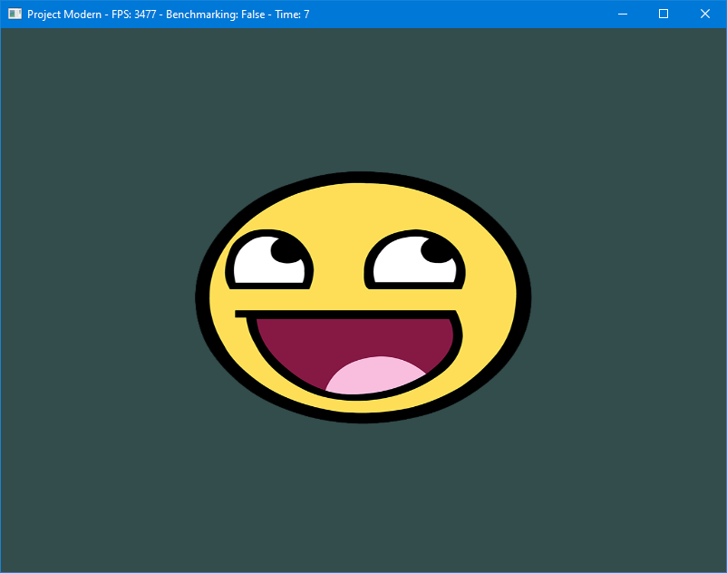
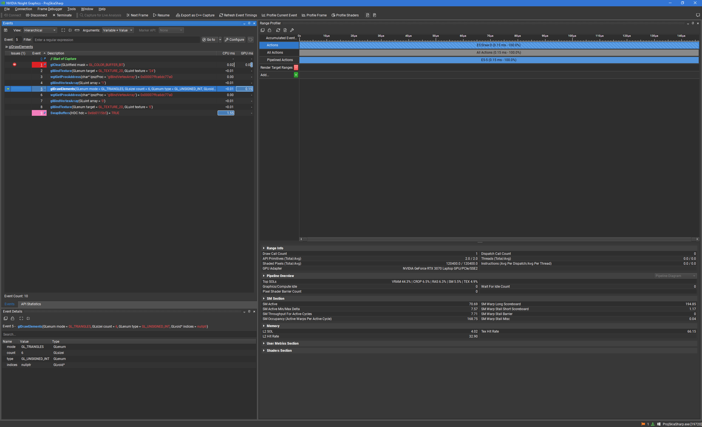

# GXP Tech Comparison
The GXP Engine is a game engine initially developed at Saxion CMGT as a replacement for Flash.  
It is currently used at the study as an educational "bridge" between Processing and Unity.  
However, the technology stack it uses is extremely outdated and not very optimal.

This project is a comparison between the current technology stack and a new proposed technology stack.

This was done for my "Advanced Tools" course at Saxion CMGT.

<!-- TOC -->
* [GXP Tech Comparison](#gxp-tech-comparison)
  * [Build instructions](#build-instructions)
  * [Evaluation proposal](#evaluation-proposal)
  * [Method](#method)
  * [Project Differences](#project-differences)
  * [Graphics Applications](#graphics-applications)
  * [Image Loader Benchmarks](#image-loader-benchmarks)
  * [Experiences](#experiences)
    * [Legacy OpenGL](#legacy-opengl)
    * [.NET Framework 4.8 vs .NET 8](#net-framework-48-vs-net-8)
    * [Graphics programs performance analysis and optimisation](#graphics-programs-performance-analysis-and-optimisation)
  * [Conclusion](#conclusion)
  * [References](#references)
<!-- TOC -->

## Build instructions
To build all four projects, make sure you are on Windows and have these SDKs installed:
- .NET Framework 4.8.1 Developer Pack ([download](https://dotnet.microsoft.com/download/dotnet-framework/net481))
- .NET 8.0 SDK ([download](https://dotnet.microsoft.com/download/dotnet/8.0))

(If you're on Linux, you can only build the Modern projects, as the Legacy projects are Windows-only.)

Then, you can open the solution file in Rider or Visual Studio, and build the projects from there.

If you want to build them from the command line, you can use MSBuild for the Legacy projects,
and the `dotnet` CLI tool for the Modern projects.  
Examples on how to use those commands can be found in
[this](./.github/workflows/benchmark-image-loaders.yml) GitHub Actions workflow file.

## Evaluation proposal
I want to compare the (graphics) performance of
 Legacy OpenGL paired with (Windows) System.Drawing running on .NET Framework 4.8,
 with Modern OpenGL paired with SkiaSharp running on .NET 8.

The former is the technology currently used in the GXP Engine,
the latter is the technology we're interested in using for NeoGXP.

## Method
To compare these two technology stacks, I have created two projects:  
One project uses the [Legacy](./Legacy) technology stack, the other uses the [Modern](./Modern) technology stack.

I have also created two other projects for benchmarking the image loading aspect of the two technology stacks,
which you can find in [BenchSysDrawing](./BenchSysDrawing) and [BenchSkiaSharp](./BenchSkiaSharp).

## Project Differences
Here's a nice table outlining the differences between the two tech stacks:

| Project                | Legacy                 | Modern                                            |
|------------------------|------------------------|---------------------------------------------------|
| Language               | `C#`                   | `C#`                                              |
| Runtime                | `.NET Framework 4.8.1` | `.NET 8`                                          |
| OpenGL Version         | `Legacy (1, I think?)` | `3.3`                                             |
| GLFW Version           | `2.6`                  | `3.3.2+`                                          |
| OpenGL & GLFW bindings | `Custom ones`          | [`Arqan`](https://github.com/TheBoneJarmer/Arqan) |
| Image Loading          | `System.Drawing`       | `SkiaSharp`                                       |
| Architecture           | `32-bit`               | `64-bit`                                          |
| Platform               | `Windows`              | `Linux & Windows`                                 |

(Project Legacy used to be called "ProjWinDrawing", and Project Modern used to be called "ProjSkiaSharp".  
I have changed the names to better suit the slightly larger comparison scope.)

.NET Framework 4.8 is the last version of the .NET Framework, and it is only supported on Windows.  
.NET 8 is the current latest version of .NET, and it is supported on many platforms.

## Graphics Applications
To compare the two technology stacks, I have created a simple application for both.
It loads an image and displays it in a window using OpenGL and GLFW.

All the image assets for these projects came from either LearnOpenGL or the GXP Engine.



The Legacy project was modelled as closely as possible to the rendering part of the current GXP Engine,
and the Modern project was then in turn modelled after the Legacy project, but with the new technology stack.

I have deliberately kept the projects as simple as possible, to make the comparison as fair as possible.
All the code is in a single file.

The measured performance data are the delta time between frames, for every frame rendered, over a period of 10 seconds,
after a warm-up period of 1 second.  
By default, however, the program is not in Benchmark mode, so it will run indefinitely.
By starting the program with the `benchmark` argument, it will run in Benchmark mode.

Here are the relevant parts of the code that logs the delta times:
```csharp
// The frame count, to index into the Milliseconds array
private static int _frameCount = 0;

// The list of measured delta times
//  It is prepopulared with enough space for 10 seconds at 3500 fps
//  This is to avoid having to resize the array at runtime, which is slow
private static readonly double[] Milliseconds = new double[35000];

// Before the game loop:
double lastTime = glfwGetTime();
double fpsTimer = glfwGetTime();

// In the game loop:
double deltaTime = glfwGetTime() - lastTime;
lastTime = glfwGetTime();

if (glfwGetTime() >= 11.0)
{
	// Close the window after 10 seconds:
	glfwSetWindowShouldClose(_window, 1);
}
else if (glfwGetTime() > 1.0) // skips the first second, to avoid the initial lag
{
	// Log the delta time:
	Milliseconds[_frameCount++] = deltaTime * 1000; // in milliseconds
}

// Once the program is done, the data is written to a file:
File.WriteAllLines("milliseconds.txt", Milliseconds.Where(d => d != 0.0).Select(d => d.ToString(CultureInfo.InvariantCulture)));
// The zeroes are filtered out, because they are not actual data points,
//  just the preallocated values from the array that didn't end up getting filled in
```
Here is the result of the graphics application benchmarks:

In this graph, you can see the delta times of the two projects over time.


(I've done my best to style this graph to be as clear and informative as possible,
but there's only so much I can do when I have around 30 000 data points.)

The reason the Legacy project has fewer data points is because it ran at a lower frame rate.
This naturally caused there to be fewer data points in the same time frame of 10 seconds.

In this graph, you can see the delta times of the two projects in a histogram
that shows how often a certain delta time occurred.


(The values over 0.60 ms have been clipped off to free up more space for the important parts of the data.
There were very few data points above 0.60 ms anyway. Those outliers can be seen on the previous graph.)

## Image Loader Benchmarks
The image loading benchmark projects are much simpler: it just loads an image,
and gets the pointer to the pixel data in memory, which is then returned from the function,
to prevent the compiler from optimising the function away, because it's not used.

The measuring here is done more "properly", by using [BenchmarkDotNet](https://github.com/dotnet/BenchmarkDotNet).
Using it made it incredibly simple to very accurately and properly compare the two image loading methods.  
Due to the way C# works, in regard to JIT compilation and Garbage Collection,
the first run of the benchmarks is usually slower than the rest, because it has to compile the code.
BenchmarkDotNet takes care of this by running the benchmark multiple times and discarding the first run.

I had actually already used a tool like this before, for one of my previous Java projects,
so learning this one was a breeze.  
I even managed to get it to work with the .NET Framework 4.8 project, which was a **huge** hassle.

Here is the relevant code for the image loading benchmarks:
```csharp
class ImageLoader
{
	[Benchmark]
	IntPtr LoadImageAndGetPixelsSkiaSharp()
	{
		SKBitmap bitmap = SKBitmap.Decode("assets/textures/container.jpg");
		bitmap.SetImmutable();
		return bitmap.GetPixels();
	}

	[Benchmark]
	IntPtr LoadImageAndGetPixelsSysDrawing()
	{
		Bitmap bitmap = new("assets/textures/container.jpg");
		BitmapData data = bitmap.LockBits(new Rectangle(0, 0, bitmap.Width, bitmap.Height), ImageLockMode.ReadOnly, PixelFormat.Format32bppArgb);
		bitmap.UnlockBits(data);
		return data.Scan0;
	}
}

BenchmarkRunner.Run<ImageLoader>();
```
(Here, I have combined the code for System.Drawing and SkiaSharp in one code snippet.
In reality, they are two separate projects entirely, due to using such wildly different .NET versions.)

I have also managed to create a GitHub Actions workflow that runs these benchmarks on every push to the repository,
and publishes a report to the Actions tab:


It also publishes the raw benchmark results as artifacts, so they can be downloaded and inspected.
With those artifacts, it also automatically creates a plot of the results.

Here is the result of the image loading benchmarks:


## Experiences

Here are some various thoughts and experiences I had during the development of this project:

### Legacy OpenGL
The GXP Engine started as an educational tool. And while NeoGXP doesn't have that same goal,
using more modern OpenGL does make it a better resource to learn from anyway.  
For people who want to look under the hood to see how it works, they'll learn something useful,
instead of something that had already become outdated before I was born.

Legacy OpenGL is not supported or taught basically anywhere anymore,
as I painstakingly found out during the making of this project.
It has been extremely difficult to find good resources on it.  
The only good guide I found was at https://nehe.gamedev.net/, and it is already half-broken;
all the example projects and images have disappeared.

### .NET Framework 4.8 vs .NET 8
During the development of this project, I have really felt the age of .NET Framework 4.8.
It is extremely clunky, especially in the building and packaging department.
I have really come to appreciate the new `csproj` format, and the new `dotnet` CLI tool.
They really managed to streamline the process of building and running modern .NET projects.

Trying to make GitHub Actions retrieve the dependencies, build, and run the .NET Framework 4.8 project was a true nightmare.
Many of the commands required were surprisingly badly documented, for Microsoft standards,
and some were downright contradictory. Aside from that, they were also rather nonsensical, in my opinion.
Setting up the .NET 8 project went without any issues at all, on the other hand.  
Thankfully, I managed to get it to work in the end with a lot of help from friends,
but it was not a pleasant experience at all.

One more reason to move to .NET 8.

### Graphics programs performance analysis and optimisation
During the development of this project, I have learned a lot about performance analysis for graphics programs.

I already knew of Renderdoc and Nsight, but I had never used them before.

But when rewriting the Legacy project to use Modern OpenGL, I initially just couldn't get it to be faster.
Or even the same speed. It just kept being slower.  
I had no idea why, and so I decided to try using Renderdoc to help me figure it out.
However, Renderdoc didn't work with the Legacy project because it does not support Legacy OpenGL.

And so I turned to Nsight, which does support Legacy OpenGL.  
But it didn't support 32-bit applications, which the Legacy project was.

Initially, I tried rewriting it to be 64-bit, but that was a huge hassle:  
To build to x64, I had to change that in the csproj file,
and then I had to swap out the GLFW DLL to a 64-bit one.  
But I couldn't just download the 64-bit GLFW DLLs,
because I didn't know which version of GLFW the Legacy project was actually using,
as it is not specified or documented anywhere.  
Only by looking through the DLL with a hex editor did I find out that it was using GLFW 2.6.  
There were no binaries to download for that ancient version, so I had to build them myself.  
After downloading a copy of the source code from SourceForge, I saw that it had a make script.  
I finally managed to execute that script with the nmake program in the Visual Studio Developer PowerShell.  
However, the included make script only ended up building as a 32-bit DLL, and I was not about to start porting _that_ to 64-bit.  
So that was a dead end.

I then got the bright idea to just use an older version of Nsight that _did_ still support 32-bit applications.
After looking through the release notes of a bunch of versions, I finally found one that did: 2021.4.2.

After installing that, I finally managed to start the Legacy project with Nsight, and make a connection to it.
However, somehow, the connection was only half-working.
Ironically, exactly the half that I didn't need...

A couple of days later, I did manage to make a connection, though!
And so I was able to compare the performance of the two projects side-by-side, using the profiling tools in Nsight.




Even though the Modern code was fewer total OpenGL instructions, it was still slower.

I saw that I was setting the shader program every frame, which was unnecessary, as I only have one to begin with.
So I optimised that out
([commit](https://github.com/TechnicJelle/GXPTechComparison/commit/27eb9a4f5a36933948ef93c100c3ec8683a42f71)),
but it made little difference.

Ultimately, I found out that the issue lay in the amount of data I was sending to the GPU.

In the Legacy project, every vertex only has its position as a 2D vector and the texture coordinates as a 2D vector.
The colour is set for the entire object at once.  

However, due to having written the Modern project with perhaps a bit too much inspiration from the Learn OpenGL tutorials,
every vertex had the position as a 3D vector and the texture coordinates as a 2D vector.  
Seeing as the GXP Engine is an engine meant for 2D games, it doesn't need 3D vectors for the position,
so I changed that to 2D vectors ([commit](https://github.com/TechnicJelle/GXPTechComparison/commit/1c02ec0bacf19b8734e664d8d43f89a65686ec1c)).  
(It could be useful for layering, but that's not something that the GXP Engine does.
You control the "layering" by the order in which you draw things.)  
This helped a bit, but it was still slower.

I then realised that I was also sending the colour as a 3D vector for every single vertex individually,
Instead of setting the colour for the entire object at once.  
This was unnecessary, as the colour is always the same for every vertex in the object.

So I made the Modern project only send the same data to the GPU that the Legacy project was sending,
and with that, I managed to get it to be faster than the Legacy project! 
([commit](https://github.com/TechnicJelle/GXPTechComparison/commit/8d1e09d6954a7954f84db669b824b6dff7db1aac))

## Conclusion
The Modern technology stack is generally more performant than the Legacy technology stack.
It is also being more modern, better supported, better documented, and just plain simpler,
while still offering more control and features in case you want it at the same time.

Even though SkiaSharp may be a bit slower at image loading than System.Drawing,
I don't think that's a big enough reason to not switch to it,
considering all the other advantages of SkiaSharp, like cross-platform support.  
It really is a pretty small difference, and it's only in the image loading part of the program,
which should not happen very often anyway.

## References

Bavoil, L. (2023, February 13). _The Peak-Performance-Percentage Analysis Method for Optimizing Any GPU Workload_. NVIDIA Technical Blog.
Retrieved April 20, 2024, from https://developer.nvidia.com/blog/the-peak-performance-analysis-method-for-optimizing-any-gpu-workload

De Vries, J. and contributors. (2015, March 23). _Learn OpenGL, extensive tutorial resource for learning Modern OpenGL_. Learn OpenGL.
Retrieved February 21, 2023, from https://learnopengl.com/

Molofee, J. (2000, January). _Your First Polygon_. NeHe Productions.
Retrieved April 12, 2024, from https://nehe.gamedev.net/tutorial/your_first_polygon/13002/
